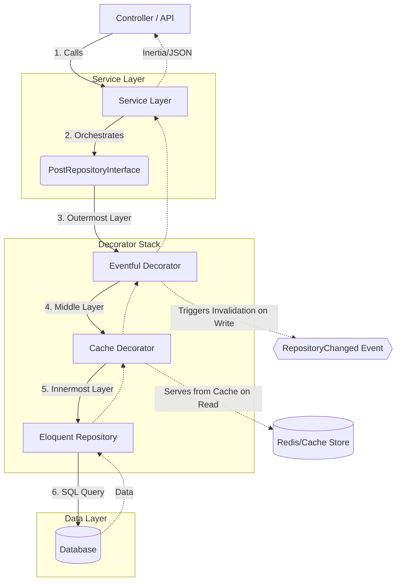

# 🏛️ Full Repository Service Workflow Guide

This document provides a complete technical guide for implementing a new module using the project's Repository-Decorator-Service architecture.

---

## 📑 Table of Contents

- [🏛️ Full Repository Service Workflow Guide](#️-full-repository-service-workflow-guide)
	- [📑 Table of Contents](#-table-of-contents)
	- [1. Architectural Flow Chart](#1-architectural-flow-chart)
	- [2. Implementation Flow (Step-by-Step)](#2-implementation-flow-step-by-step)
		- [Step 1: Interface (The Contract)](#step-1-interface-the-contract)
		- [Step 2: Eloquent Repository (The Implementation)](#step-2-eloquent-repository-the-implementation)
		- [Step 3: Cache Decorator (Performance)](#step-3-cache-decorator-performance)
		- [Step 4: Eventful Decorator (Invalidation)](#step-4-eventful-decorator-invalidation)
		- [Step 5: Binding (The Glue)](#step-5-binding-the-glue)
		- [Step 6: Service Integration (The Orchestrator)](#step-6-service-integration-the-orchestrator)
	- [3. Opting Out of Caching (Simple Workflow)](#3-opting-out-of-caching-simple-workflow)
		- [The Strategy](#the-strategy)
		- [Steps to Skip Caching](#steps-to-skip-caching)
		- [Workflow Comparison](#workflow-comparison)
		- [Sample Binding (Same as Step 5)](#sample-binding-same-as-step-5)
	- [4. Important Notes \& Patterns](#4-important-notes--patterns)
		- [🛡️ Runtime \& Static Safety](#️-runtime--static-safety)
		- [🧩 Query Scopes](#-query-scopes)
		- [⚡ Automation](#-automation)
	- [5. Flow Checklist](#5-flow-checklist)

---

## 1. Architectural Flow Chart

This diagram illustrates how a request flows through the layers, showing the stacking order of decorators.



---

## 2. Implementation Flow (Step-by-Step)

We will use the **`Post`** model as a reference implementation.

### Step 1: Interface (The Contract)

**Path:** `app/Repositories/Contracts/PostRepositoryInterface.php`

The interface defines what the repository can do. It allows the Service to remain decoupled from the database implementation.

```php
interface PostRepositoryInterface extends BaseRepositoryInterface
{
    public function getLatestPosts(int $limit = 6): Collection;
    public function publish(Post $model): Post;
}
```

### Step 2: Eloquent Repository (The Implementation)

**Path:** `app/Repositories/Eloquent/PostRepository.php`

This is where the actual database queries live. 
>**Note:** Always use Model Scopes to keep queries reusable and readable.

```php
final class PostRepository extends BaseRepository implements PostRepositoryInterface
{
    public function model(): string { return Post::class; }

    public function getLatestPosts(int $limit = 6): Collection
    {
        return $this->query()
            ->published()            // Model Scope
            ->withFrontendMetadata() // Model Scope
            ->latest()
            ->limit($limit)
            ->get();
    }
}
```

### Step 3: Cache Decorator (Performance)

**Path:** `app/Repositories/Cache/CachedPostRepository.php`

Intercepts read calls to serve data from the cache.

```php
/** @property PostRepositoryInterface $inner */
final class CachedPostRepository extends SoftDeleteCachedRepository implements PostRepositoryInterface
{
    /**
     * @param PostRepositoryInterface $inner Enforced by type hint and check.
     */
    public function __construct(
        \App\Repositories\Contracts\BaseRepositoryInterface $inner,
        RepositoryCache $cache,
        string $namespace
    ) {
        // 🛡️ Note: Constructor validation ensures runtime safety
        if (!$inner instanceof PostRepositoryInterface) {
            throw new RepositoryException('Inner repository must implement PostRepositoryInterface');
        }
        parent::__construct($inner, $cache, $namespace);
    }

    public function getLatestPosts(int $limit = 6): Collection
    {
        return $this->remember('getLatestPosts', [$limit], fn() => $this->inner->getLatestPosts($limit));
    }
}
```

### Step 4: Eventful Decorator (Invalidation)

**Path:** `app/Repositories/Decorators/EventfulPostRepository.php`

Triggers events on write operations to clear cache or trigger side effects.

```php
/** @property PostRepositoryInterface $inner */
final class EventfulPostRepository extends SoftDeleteEventfulRepository implements PostRepositoryInterface
{
    /**
     * @param PostRepositoryInterface $inner Enforced by type hint and check.
     */
    public function __construct(
        \App\Repositories\Contracts\BaseRepositoryInterface $inner,
        string $namespace
    ) {
        // 🛡️ Runtime Safety
        if (! $inner instanceof PostRepositoryInterface) {
            throw new RepositoryException('Inner repository must implement PostRepositoryInterface');
        }

        parent::__construct($inner, $namespace);
    }

    public function publish(Post $model): Post
    {
        $result = $this->inner->publish($model);
        // 📢 Dispatches event to clear cache automatically
        Event::dispatch(new RepositoryChanged($this->namespace));
        return $result;
    }
}
```

### Step 5: Binding (The Glue)

**Path:** `app/Providers/RepositoryServiceProvider.php`

The provider wires the layers together.

```php
// Inside register()
$this->bindRepo(PostRepositoryInterface::class, PostRepository::class);
```

### Step 6: Service Integration (The Orchestrator)

**Path:** `app/Services/PostService.php`

The Service handles business logic and coordinates multiple repositories if needed.

```php
class PostService
{
    public function __construct(protected PostRepositoryInterface $postRepository) {}

    public function getHomepageContent()
    {
        // Service doesn't know about cache or events; it just calls the interface.
        return $this->postRepository->getLatestPosts();
    }
}
```

---

## 3. Opting Out of Caching (Simple Workflow)

If you have a module that doesn't require caching (e.g., highly dynamic data or low-traffic administrative tasks), you can implement a simplified version of the pattern.

### The Strategy

Our `RepositoryServiceProvider` is designed to be smart. If it doesn't find the specialized `Cached` or `Eventful` classes for your model, it will automatically fall back to using generic wrappers.

### Steps to Skip Caching

1. **Skip Step 3 & 4**: Do not create `Cached{Model}Repository.php` or `Eventful{Model}Repository.php`.
2. **Generic Fallback**: The system will automatically wrap your `EloquentRepository` in the base `CachedRepository` and `EventfulRepository`. These base classes handle standard methods (`find`, `paginate`, `create`, etc.) but will **not** cache your custom specialized methods.

### Workflow Comparison

| Feature | Full Stack (Steps 1-6) | Simple Stack (Skip 3 & 4) |
| :--- | :--- | :--- |
| **Standard Methods** | Cached | Cached (Generic) |
| **Custom Methods** | Cached (Manual `remember`) | **Not Cached** (Direct DB) |
| **Write Events** | Specialized | Generic (Automatic) |

### Sample Binding (Same as Step 5)

You still use the same binding helper. The system detects the missing files and adjusts the decorator stack automatically.

```php
// RepositoryServiceProvider.php
$this->bindRepo(AuditLogRepositoryInterface::class, AuditLogRepository::class);
```

---

## 4. Important Notes & Patterns

### 🛡️ Runtime & Static Safety

1. **`@property` Docblock**: Essential for IDEs and Static Analysis. Since the base decorator uses a generic `$inner`, this docblock "re-types" it for the specific implementation.
2. **Constructor Validation**: We implement `if (!$inner instanceof ...)` in decorators to catch misconfigurations early at instantiation rather than getting cryptic "method not found" errors later.

### 🧩 Query Scopes

Don't write complex `where` or `select` clauses in the Repository. Move them to the **Model** as Scopes:

- **Good**: `$this->query()->published()->latest()->get()`
- **Bad**: `$this->query()->where('status', 'published')->whereNotNull('published_at')->orderBy('created_at', 'desc')->get()`

### ⚡ Automation

Use the built-in command to generate all files correctly formatted with the above patterns:

```bash
php artisan make:repo YourModelName
```

---

## 5. Flow Checklist

| Layer | Responsibility | Key Technique |
| :--- | :--- | :--- |
| **Interface** | Define Contract | Method Signatures |
| **Eloquent** | Database Logic | Model Scopes |
| **Cache** | Performance | `remember()` Helper |
| **Eventful** | Invalidation | `RepositoryChanged` Event |
| **Provider** | Injection Logic | `bindRepo()` helper |
| **Service** | Business Logic | `TransactionTrait` |
