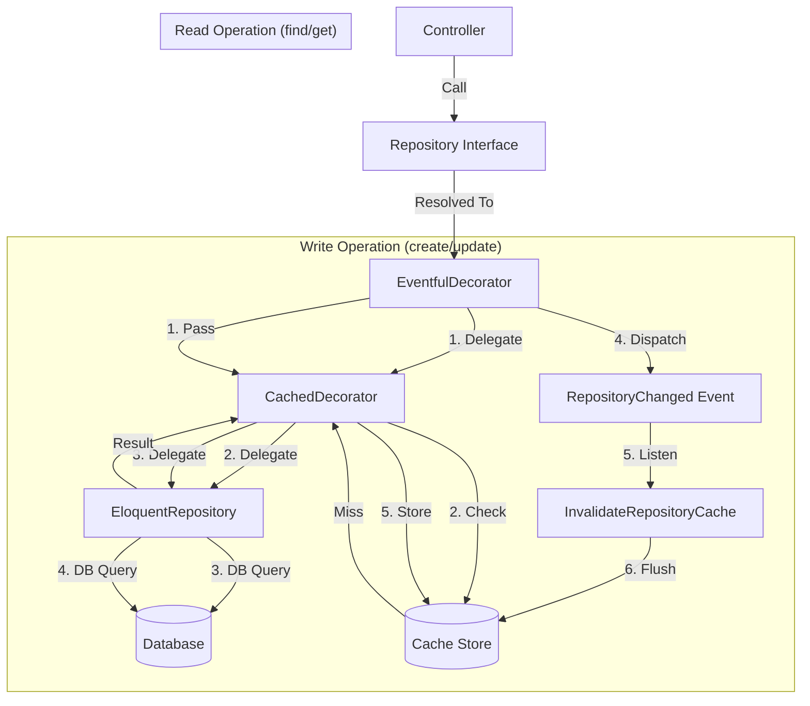

# 📘 Repository Pattern with Caching & Events

> **Status**: Active
> **Pattern**: Decorator + Repository
> **Example Model**: `Post`

This guide details our robust **Repository Pattern** implementation, enhanced with the **Decorator Pattern** to handle Caching and Event dispatching transparently.

---

## 📑 Table of Contents

<details close>
<summary>Click to expand/collapse</summary>

- [📘 Repository Pattern with Caching \& Events](#-repository-pattern-with-caching--events)
	- [📑 Table of Contents](#-table-of-contents)
	- [1. Architecture Overview](#1-architecture-overview)
		- [Visual Flow](#visual-flow)
	- [2. Why This Architecture?](#2-why-this-architecture)
	- [3. Component Breakdown](#3-component-breakdown)
		- [3.1 The Interface](#31-the-interface)
			- [❓ Why do that?](#-why-do-that)
			- [🛠 How to do that?](#-how-to-do-that)
			- [📝 Sample](#-sample)
		- [3.2 The Eloquent Implementation](#32-the-eloquent-implementation)
			- [❓ Why do that?](#-why-do-that-1)
			- [🛠 How to do that?](#-how-to-do-that-1)
			- [📝 Sample](#-sample-1)
		- [3.3 The Cache Decorator](#33-the-cache-decorator)
			- [❓ Why do that?](#-why-do-that-2)
			- [🛠 How to do that?](#-how-to-do-that-2)
			- [📝 Sample](#-sample-2)
		- [3.4 The Event Decorator](#34-the-event-decorator)
			- [❓ Why do that?](#-why-do-that-3)
			- [🛠 How to do that?](#-how-to-do-that-3)
			- [📝 Sample](#-sample-3)
	- [4. Binding It All Together](#4-binding-it-all-together)
	- [5. Usage Example](#5-usage-example)
	- [6. How to Create a New Repository](#6-how-to-create-a-new-repository)
		- [🚀 The Easy Way (Command)](#-the-easy-way-command)
		- [🛠 The Manual Way (Checklist)](#-the-manual-way-checklist)
	- [7. Directory Structure](#7-directory-structure)
	- [8. Pros and Cons](#8-pros-and-cons)

</details>

---

## 1. Architecture Overview

We use a **Layered Decorator Stack** to wrap the actual Eloquent Repository. This allows us to "**`decorate`**" the basic database operations with additional behavior (caching, events) without modifying the core logic.

### Visual Flow



---

## 2. Why This Architecture?

- **Separation of Concerns**: Your Controller doesn't care about Caching. Your Eloquent model doesn't care about Events. Each layer does exactly one thing.
- **Performance by Default**: Read operations are cached automatically.
- **Consistency**: Every model follows the exact same flow.
- **Testability**: You can easily mock the `PostRepositoryInterface` in your unit tests, ignoring the database entirely.

---

## 3. Component Breakdown

We will use the **`Post`** model as our primary example.

### 3.1 The Interface

The contract that defines *what* can be done, not *how*.

#### ❓ Why do that?

To decouple the application code (Services/Controllers) from the specific implementation (Database/Eloquent). This makes swapping implementations or mocking for tests trivial.

#### 🛠 How to do that?

Create an interface extending `BaseRepositoryInterface`. Add method signatures for any custom logic specific to Posts.

#### 📝 Sample

**File:** `app/Repositories/Contracts/PostRepositoryInterface.php`

```php
interface PostRepositoryInterface extends BaseRepositoryInterface
{
    // Custom method specific to Posts
    public function getPublishedPosts(int $limit = 10): LengthAwarePaginator;
}
```

---

### 3.2 The Eloquent Implementation

The actual worker that talks to the database.

#### ❓ Why do that?

We need a concrete class to execute SQL queries using Eloquent models.

#### 🛠 How to do that?

Extend `BaseRepository` and implement your interface. Define the `model()` method.

#### 📝 Sample

**File:** `app/Repositories/Eloquent/PostRepository.php`

```php
class PostRepository extends BaseRepository implements PostRepositoryInterface
{
    public function model(): string
    {
        return Post::class;
    }

    public function getPublishedPosts(int $limit = 10): LengthAwarePaginator
    {
        // Pure Eloquent Logic
        return $this->query()
            ->where('status', 'published')
            ->orderByDesc('published_at')
            ->paginate($limit);
    }
}
```

---

### 3.3 The Cache Decorator

The layer responsible for remembering results.

#### ❓ Why do that?

To reduce database load and speed up read operations. By wrapping the repository, we can cache specific methods without polluting the Eloquent repository code.

#### 🛠 How to do that?

Extend `CachedRepository`. Override read methods (like `getPublishedPosts`) to use `remember()`.

#### 📝 Sample

**File:** `app/Repositories/Cache/CachedPostRepository.php`

```php
class CachedPostRepository extends CachedRepository implements PostRepositoryInterface
{
    public function getPublishedPosts(int $limit = 10): LengthAwarePaginator
    {
        // Cache Key is generated automatically based on method name + args
        return $this->remember(
            'getPublishedPosts', 
            [$limit, request('page')], // Arguments that affect the result
            fn() => $this->inner->getPublishedPosts($limit) // Fallback if cache miss
        );
    }
}
```

---

### 3.4 The Event Decorator

The layer responsible for announcing changes.

#### ❓ Why do that?

When a Post is created, updated, or deleted, we need to clear the cache. We might also want to trigger other actions (emails, logs). This decorator handles that automatically.

#### 🛠 How to do that?

Extend `EventfulRepository`. Usually, you don't need to add anything here unless you have custom *write* methods. Standard write methods (`create`, `update`, `delete`) are already handled by the parent class.

#### 📝 Sample

**File:** `app/Repositories/Decorators/EventfulPostRepository.php`

```php
class EventfulPostRepository extends EventfulRepository implements PostRepositoryInterface
{
    // Pass-through custom read methods
    public function getPublishedPosts(int $limit = 10): LengthAwarePaginator
    {
        return $this->inner->getPublishedPosts($limit);
    }
    
    // If you had a custom write method, you would wrap it here:
    // public function publish(int $id) {
    //     $this->inner->publish($id);
    //     Event::dispatch(new RepositoryChanged($this->namespace));
    // }
}
```

---

## 4. Binding It All Together

We must tell Laravel: *"When someone asks for `PostRepositoryInterface`, give them the `EventfulPostRepository` (which wraps `CachedPostRepository`, which wraps `PostRepository`)."*

**File:** `app/Providers/RepositoryServiceProvider.php`

```php
public function register(): void
{
    // ...
    // The bindRepo helper handles the wrapping automatically!
    $this->bindRepo(PostRepositoryInterface::class, PostRepository::class);
}
```

---

## 5. Usage Example

In your Service or Controller, you simply inject the interface. You don't need to know about the complex caching/event logic happening behind the scenes.

```php
class PostController extends Controller
{
    public function __construct(
        protected PostRepositoryInterface $postRepo
    ) {}

    public function index()
    {
        // 1. Calls EventfulPostRepository (Pass through)
        // 2. Calls CachedPostRepository (Checks Redis...)
        // 3. Returns cached data OR calls DB
        $posts = $this->postRepo->getPublishedPosts();
        
        return Inertia::render('Posts/Index', ['posts' => $posts]);
    }
    
    public function store(Request $request)
    {
        // 1. Calls EventfulPostRepository
        // 2. Delegates to DB
        // 3. On success, Dispatches 'RepositoryChanged' event
        // 4. Listener hears event -> Clears Cache for Posts
        $this->postRepo->create($request->validated());
    }
}
```

---

## 6. How to Create a New Repository

We have a dedicated Artisan command to generate all 4 files and register the binding for you.

### 🚀 The Easy Way (Command)

```bash
# Standard Repository
php artisan make:repo Post

# With Soft Deletes support
php artisan make:repo Post --soft
```

### 🛠 The Manual Way (Checklist)

1. Create **`Contracts/PostRepositoryInterface.php`**
2. Create **`Eloquent/PostRepository.php`**
3. Create **`Cache/CachedPostRepository.php`**
4. Create **`Decorators/EventfulPostRepository.php`**
5. Register in **`RepositoryServiceProvider.php`**

---

## 7. Directory Structure

Your `app/Repositories` folder will look like this:

```
app/Repositories/
├── Contracts/                  # 1. Interfaces
│   ├── BaseRepositoryInterface.php
│   └── PostRepositoryInterface.php
│
├── Eloquent/                   # 2. Database Logic
│   ├── BaseRepository.php
│   └── PostRepository.php
│
├── Cache/                      # 3. Cache Logic
│   ├── CachedRepository.php
│   └── CachedPostRepository.php
│
└── Decorators/                 # 4. Event Logic
    ├── EventfulRepository.php
    └── EventfulPostRepository.php
```

---

## 8. Pros and Cons

| Feature | Pros | Cons |
| :--- | :--- | :--- |
| **Separation** | Code is clean, focused, and follows SOLID principles. | More files to manage (4 files per model). |
| **Caching** | Automatic, robust, and centralized. | Developers must remember to add cache wrappers for custom methods. |
| **Performance** | Significant speedup for read-heavy apps. | Slight overhead in function calls (negligible). |
| **Maintenance** | Easy to change implementation details without breaking the app. | Higher learning curve for junior developers. |
